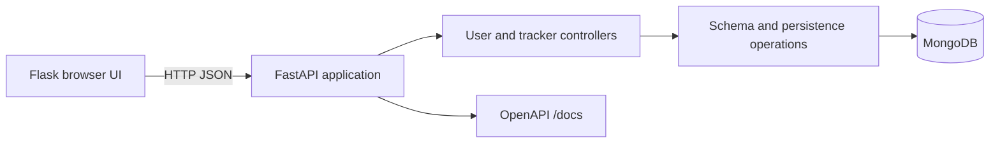

# Hydration Tracker API

Hydration Tracker is a small full-stack Python application that calculates a daily water goal from a user's weight, records water consumption, and exposes the data through a FastAPI API and Flask web interface.

It demonstrates a practical API workflow: MongoDB persistence, validated request/response models, automatic OpenAPI documentation, rate limiting, a browser UI, Docker packaging, and an integration test flow.

## What I Built

- A FastAPI service for users and daily hydration trackers.
- A Flask UI mounted at `/app` for registering users, recording intake, and viewing history.
- A MongoDB data layer with indexes for user lookup and one tracker per user per day.
- A hydration goal calculation of `weight in kg * 35 ml`.
- Optional rate limiting and TLS configuration through environment variables.
- A reproducible Docker Compose demo containing the API and MongoDB.

## Problem And Motivation

People often know they should drink more water but lack a simple way to turn a daily target into a trackable routine. This project explores the engineering behind a focused tracker: input validation, persistence, daily state, API design, and a small user-facing workflow without introducing a large frontend framework.

## Features

| Area | Capability |
| --- | --- |
| Users | Create, list, read, update, and delete users |
| Tracking | Create or retrieve a tracker for a date and record intake |
| Goals | Calculate a daily target from body weight |
| History | Retrieve a user's tracker history with an optional limit |
| UI | Register a user, choose a cup size, see progress, and review history |
| API | FastAPI validation, Swagger UI, ReDoc, and exported OpenAPI YAML |
| Operations | Environment configuration, request limiting, Docker, and health check |

## Architecture And Workflow



The active request path is:

```text
Browser or API client
        |
        v
FastAPI route -> Pydantic model validation -> database schema operation -> MongoDB
        |
        v
JSON response or rendered Flask page
```

The daily tracker flow is:

```text
User weight -> weight * 35 ml goal -> daily tracker -> intake update -> consumed/missing/percent
```

## Technology

- Python 3.10+ (the Docker image uses Python 3.10)
- FastAPI and Uvicorn for the API
- Flask and Jinja2 for the browser UI
- Pydantic for validation and response models
- MongoDB and PyMongo for persistence
- pytest for tests
- Docker and Docker Compose for a repeatable demo

## Project Structure

```text
.
├── app.py                         # ASGI application and startup entry point
├── config/settings.py              # Environment-backed configuration
├── database/
│   ├── database.py                 # MongoDB connection, indexes, and retries
│   ├── verify_db.py                # Standalone connectivity probe
│   └── schemas/                    # Persistence and domain operations
├── src/
│   ├── controllers/                # FastAPI routes and Flask page routes
│   ├── middleware/rate_limiter.py  # In-process request limiter
│   ├── models/                     # Pydantic API contracts
│   └── views/                      # Jinja templates and CSS
├── tests/                          # Integration and deterministic model tests
├── docs/                           # Generated OpenAPI output; not committed
├── extract_openapi.py              # OpenAPI export utility
├── docker-compose.yml              # API + MongoDB local demo
└── requirements.txt                # Python dependencies
```

## Setup

### Option A: Docker Compose (recommended demo)

Requirements: Docker Desktop with Compose enabled.

```bash
docker compose up --build
```

Open:

- UI: <http://localhost:8000/app/>
- Swagger UI: <http://localhost:8000/docs>
- ReDoc: <http://localhost:8000/redoc>
- Root response: <http://localhost:8000/> returns `{"Hello": "World"}`

Stop the stack with `Ctrl+C`, or run `docker compose down`. MongoDB data is kept in the named `mongodb_data` volume.

### Option B: Local Python and MongoDB

Requirements: Python 3.10-3.12, a running MongoDB instance, and a virtual environment.

```bash
python -m venv .venv
# Windows PowerShell
.\.venv\Scripts\Activate.ps1
# macOS/Linux: source .venv/bin/activate
python -m pip install --upgrade pip
python -m pip install -r requirements.txt
Copy-Item .env.example .env  # PowerShell; use cp on macOS/Linux
python app.py
```

For MongoDB in Docker only:

```bash
docker run --rm --name hydration-mongodb -p 27017:27017 mongo:7
```

The application listens on `http://localhost:8000` by default.

## Example API Usage

Create a user:

```bash
curl -X POST http://localhost:8000/user/ ^
  -H "Content-Type: application/json" ^
  -d "{\"name\":\"Ada Lovelace\",\"weight\":65}"
```

PowerShell alternative:

```powershell
$user = Invoke-RestMethod -Method Post -Uri http://localhost:8000/user/ `
  -ContentType 'application/json' -Body '{"name":"Ada Lovelace","weight":65}'
$user
```

Use the returned `id` to create or retrieve today's tracker:

```bash
curl http://localhost:8000/user/<USER_ID>/tracker/
curl -X PUT http://localhost:8000/user/<USER_ID>/tracker/<YYYY-MM-DD>/ \
  -H "Content-Type: application/json" \
  -d '{"cupsize":350}'
curl http://localhost:8000/user/<USER_ID>/history/
```

The response includes `goal`, `consumed`, `missing`, `goal_percent`, and `goal_reached`. Exact values depend on the user weight and intake submitted; the repository does not claim benchmark or health outcomes.

## Configuration And Reproducibility

Copy `.env.example` to `.env` and adjust values as needed. Settings are loaded by `config/settings.py`.

| Variable | Default | Purpose |
| --- | --- | --- |
| `MONGODB_URI` | `mongodb://localhost:27017` | MongoDB connection string |
| `DB_NAME` | `hydration_tracker` | Database name |
| `API_HOST` | `0.0.0.0` | Server bind address |
| `API_PORT` | `8000` | Server port |
| `API_DEBUG` | `false` | Uvicorn reload mode |
| `API_BASE_URL` | `http://localhost:8000` | Base URL used by the Flask UI |
| `RATE_LIMIT_ENABLED` | `true` | Enable the in-process limiter |
| `RATE_LIMIT_PER_MINUTE` | `60` | Requests per client per minute |
| `SSL_ENABLED` | `false` | Enable optional local TLS |

Do not place credentials, private keys, certificates, datasets, or local `.env` files in Git. TLS paths are supported for mounted files and are ignored by `.gitignore`.

## Tests And Validation

Run deterministic model tests with:

```bash
python -m pytest tests/test_models.py -q
```

The API tests in `tests/api_test.py` are integration tests. They require a reachable MongoDB and exercise the user and tracker endpoints. The full suite is:

```bash
python -m pytest -q
```

The project currently has no benchmark dataset or experiment pipeline. Results are runtime API responses, not fabricated evaluation metrics.

Export the current API contract after starting a configured environment:

```bash
python extract_openapi.py --out openapi.yaml --out-dir docs
```

## Technical Highlights

- Designed a layered FastAPI/MongoDB application with a small mounted Flask experience.
- Implemented daily tracker creation, goal calculation, intake updates, and history retrieval.
- Added Pydantic validation for user and tracker data at the API boundary.
- Added MongoDB indexes, bounded connection timeouts, and retry handling for transient operations.
- Added optional rate limiting, TLS configuration, structured logging, and a non-root Docker image.
- Added a reproducible two-container demonstration path and an OpenAPI export utility.

## Limitations

- The rate limiter is in-process and is not suitable for horizontally scaled deployments.
- Authentication and authorization are not implemented; user IDs currently act as the lookup key.
- The browser UI calls the API through localhost and is intended for the bundled local deployment.
- MongoDB is required for the integration workflow; no in-memory production substitute is provided.
- The hydration formula is a simple project rule, not medical advice or a clinical recommendation.

## Future Improvements

- Add authentication, authorization, and ownership checks.
- Move rate limiting to a shared store for multi-instance deployments.
- Add repository/service interfaces to support isolated unit tests without MongoDB.
- Add CI for formatting, type checking, tests, and OpenAPI drift detection.
- Add timezone-aware tracker dates and configurable goal formulas.
- Improve frontend error handling and serve API/UI configuration from one runtime setting.

## Troubleshooting

**The API cannot connect to MongoDB**

Start MongoDB with `docker compose up --build`, or check `MONGODB_URI` in `.env`. The standalone probe is `python -m database.verify_db`.

**The browser page is empty or shows an API error**

Confirm the API is running on port 8000 and open the UI at `/app/`, not the repository root. Check the terminal logs for the failed request.

**The OpenAPI exporter fails**

Install the declared dependencies, start the application environment so its MongoDB import can initialize, then run `python extract_openapi.py --out openapi.yaml --out-dir docs`.

## Demonstration Walkthrough

1. Start with `docker compose up --build` and open `/docs` to show the API contract.
2. Explain `app.py`, the route controllers, Pydantic models, and MongoDB indexes.
3. Create a user from Swagger UI or the PowerShell example.
4. Call the daily tracker endpoint, record `350` ml, and show `consumed`, `missing`, and `goal_percent` changing.
5. Open `/app/<USER_ID>/tracker/` and `/app/<USER_ID>/history/` to demonstrate the browser workflow.
6. Explain the trade-off of using a simple weight-based goal and an in-process limiter.
7. Discuss authentication, shared rate limiting, timezone handling, and repository/service isolation as the next engineering steps.

## Project Information

Hydration Tracker was developed by Gabriel Coelho as a practical FastAPI, Flask, and MongoDB project. The repository is licensed under the MIT License; see [LICENSE](LICENSE).
